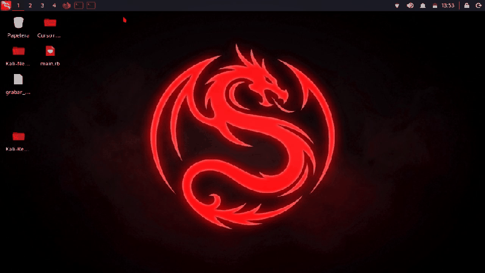
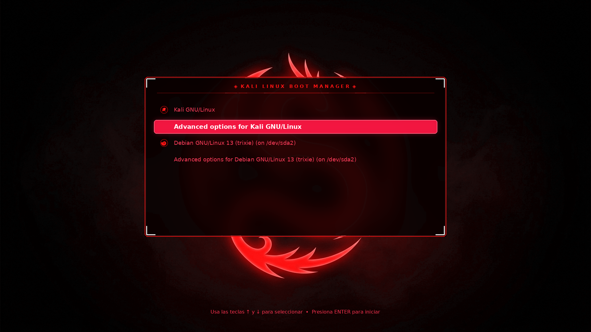
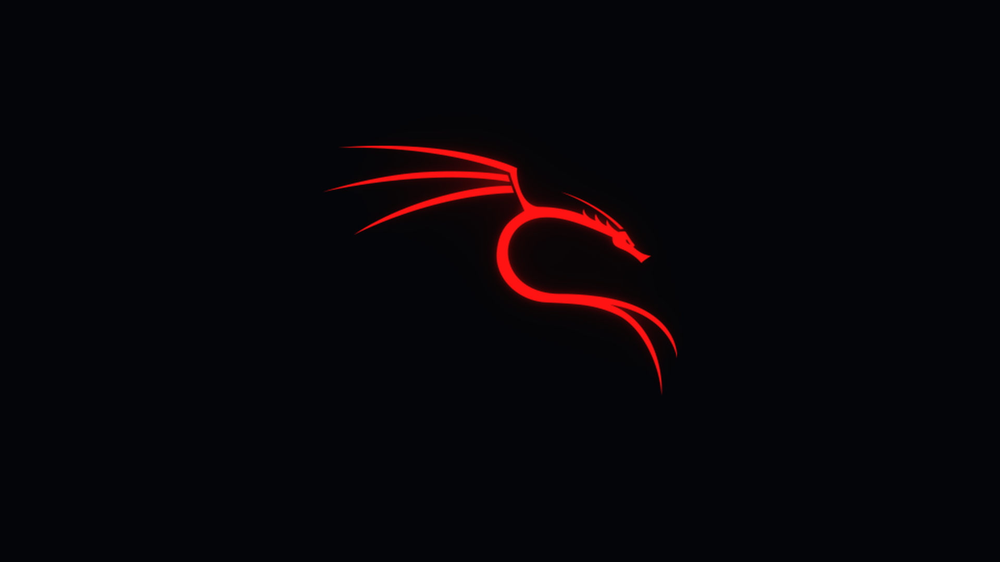
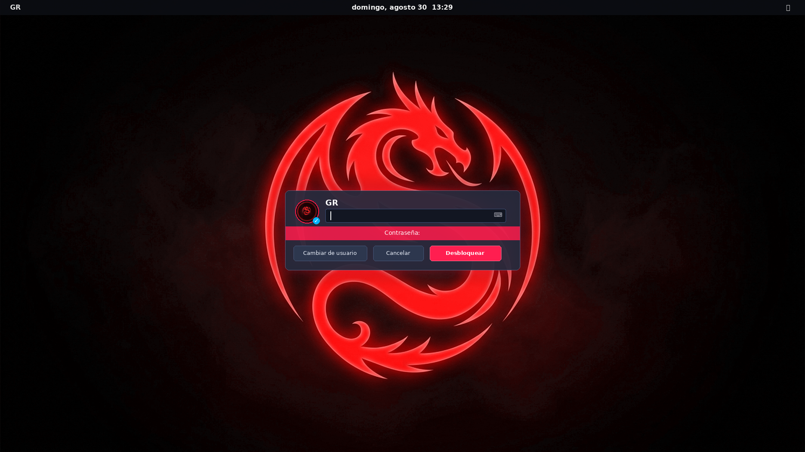
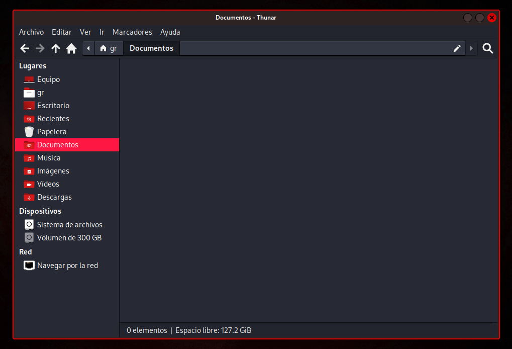

<div align="center">

# KALI DRAGON SUITE
### *The Ultimate Cyberpunk & Neon Transformation for Kali Linux (XFCE)*

[](https://www.kali.org/)
[](https://www.xfce.org/)
[](#ediciones-de-color)
[](#características-técnicas)
[](LICENSE)

<br/>

> **Suite integral, modular y optimizada de personalización para Kali Linux:**  
> Menú GRUB 1080p, pantalla de carga Plymouth, inicio de sesión LightDM, bloqueo de pantalla glassmorphic, bordes neón de 2px, animador cinemático del dragón (60 FPS), temas GTK3/4 de alto contraste, iconos Flat-Remix y prompt para la terminal ZSH.

</div>

---

## NOTA

> *"Este es mi primer proyecto que desarrollo para Linux y quise compartirlo con la comunidad. La idea nació para darle a Kali Linux una estética neón / cyberpunk visualmente épica, pero manteniéndolo ligero y sin que devore los recursos de tu máquina.*  
> *Varias de las texturas y artes base se generaron con ayuda de Gemini. Si llegan a encontrar algún detalle, bug visual o tienen alguna idea de mejora, con toda confianza abran un [Issue](https://github.com/Gabo-Razo/Kali-Dragon-Suite/issues) y trataré de responder y solucionarlo lo antes posible. ¡Ojalá les sea de gran utilidad y lo disfruten!"*  
> — **Gabo Razo** ([@Gabo-Razo](https://github.com/Gabo-Razo))

---

## Galería Visual

<div align="center">

### 1. Animador Cinemático del Dragón (Vuelo en Ventanas a 60 FPS)
*El dragón recorre el contorno de la ventana con estela de plasma y resplandor al abrir aplicaciones.*



<br/>

### 2. Menú de Arranque GRUB (1080p Crystal Glass)
*Fondo oscuro con aura neón, marco cibernético y más de 70 iconos de sistemas operativos.*



<br/>

### 3. Pantalla de Carga Plymouth (Neon Splash)
*Animación de arranque limpia y fluida sobre fondo negro puro.*



<br/>

### 4. Pantalla de Bloqueo y Suspensión (xfce4-screensaver)
*Tarjeta glassmorphic con avatar circular iluminado, campo de contraseña y botones de acción.*



<br/>

### 5. Bordes Finos de 2px y Tema de Escritorio (GTK3 & GTK4)
*Ventanas con contorno neón de 2px, botones circulares y colores 100% sólidos de alto contraste.*



</div>

---

## Ediciones de Color

Todos los colores están calibrados para ofrecer la máxima saturación neón sobre fondos oscuros profundos, garantizando legibilidad y alto contraste:

| # | Edición | Flag CLI | Color Primario | Estilo / Vibe |
| :-: | :--- | :--- | :--- | :--- |
| 1 | **Crimson Red** | `red` | `#ff1744` / `#ec0101` | Rojo Neón Carmesí (Edición Original) |
| 2 | **Plasma Blue** | `blue` | `#00b0ff` / `#2979ff` | Azul Eléctrico Cyberpunk |
| 3 | **Toxic Green** | `green` | `#00e676` / `#00c853` | Verde Hacker Matrix |
| 4 | **Cyber Yellow** | `yellow` | `#ffd600` / `#ffc107` | Amarillo Neón Intenso |
| 5 | **Neon Purple** | `purple` | `#d500f9` / `#aa00ff` | Morado Synthwave / Retro City |
| 6 | **Neon Orange** | `orange` | `#ff6d00` / `#ff5722` | Naranja Incandescente / Lava |
| 7 | **Electric Lime** | `lime` | `#76ff03` / `#64dd17` | Verde Lima Ácido |
| 8 | **Cyber Pink** | `pink` | `#ff4081` / `#f50057` | Rosa Neón Arcade |
| 9 | **Neon Cyan** | `cyan` | `#18ffff` / `#00e5ff` | Azul Hielo / Arctic Ice |
| 10 | **Neon Teal** | `teal` | `#00f2fe` / `#00b4d8` | Turquesa Neón / Cyber Aqua |
| 11 | **Cyber Gold** | `gold` | `#ffab00` / `#ffd700` | Oro Metálico / Night City Amber |
| 12 | **Royal Indigo** | `indigo` | `#536dfe` / `#3d5afe` | Azul Índigo / Zafiro Profundo |
| 13 | **Quantum Mint** | `mint` | `#64ffda` / `#00bfa5` | Verde Menta Cuántico |
| 14 | **Blood Ruby** | `ruby` | `#e91e63` / `#c2185b` | Rojo Rubí / Dark Wine |
| 15 | **Cyber Magenta** | `magenta` | `#ff007f` / `#e00070` | Magenta Neón / Retrowave 80s |

---

## Módulos Disponibles

Puedes instalar la suite completa o únicamente los módulos específicos que requieras:

| Módulo | Flag CLI | Descripción |
| :--- | :--- | :--- |
| **Suite Completa** | `--all` | Instala los 8 componentes al mismo tiempo. |
| **Todo el Arranque** | `--boot-only` | Configura el menú GRUB y la pantalla Plymouth. |
| **Solo GRUB** | `--grub-only` | Instala el tema GRUB 1080p con 70+ iconos de sistemas. |
| **Solo Plymouth** | `--plymouth-only` | Despliega la animación de carga del dragón. |
| **Solo Login y Bloqueo** | `--login-only` | LightDM Greeter, pantalla de bloqueo y cuadro de apagado. |
| **Solo Bordes de Ventana** | `--borders-only` | Bordes finos de 2px (XFWM4 & GTK) sin transparencias fallidas. |
| **Solo Animador** | `--animator-only` | Daemon a 60 FPS que lanza el vuelo del dragón en ventanas. |
| **Solo Fondo de Pantalla** | `--wallpaper-only` | Wallpaper 1080p del Dragón en la edición elegida. |
| **Solo Iconos** | `--icons-only` | Iconos del panel, menú de aplicaciones y botones del sistema. |
| **Solo Terminal** | `--terminal-only` | Prompt ZSH de dos líneas y colores de cursor sin lag. |
| **Solo Escritorio** | `--desktop-only` | Bordes, animador, fondo, iconos y terminal. |

---

## Instalación

### Requisitos Previos
* **Sistema Operativo:** Kali Linux (o cualquier distribución basada en Debian con XFCE).
* **Entorno:** XFCE4.
* **Dependencias:** Python 3, PyQt6 (`python3-pyqt6`), `xprop`, `xdotool` (el instalador las revisa automáticamente).

```bash
# 1. Clonar el repositorio
git clone https://github.com/Gabo-Razo/Kali-Dragon-Suite.git
cd Kali-Dragon-Suite

# 2. Dar permisos de ejecución al instalador
chmod +x install.sh
```

### Opción A: Menú Interactivo (Recomendado)
```bash
sudo ./install.sh
```

### Opción B: Instalación por Línea de Comandos
```bash
# Instalar todo en Crimson Red:
sudo ./install.sh --color red --all

# Instalar todo en Cyber Gold:
sudo ./install.sh --color gold --all

# Instalar solo los bordes de 2px en Toxic Green:
sudo ./install.sh --color green --borders-only

# Instalar solo el arranque (GRUB + Plymouth) en Plasma Blue:
sudo ./install.sh --color blue --boot-only

# Instalar solo el Animador del Dragón en Neon Cyan:
sudo ./install.sh --color cyan --animator-only
```

---

## Características Técnicas

* **Consumo Ultrabajo (0.0% CPU en reposo):** El animador corre como daemon nativo con `systemd --user`, despertándose únicamente cuando se crea una ventana mediante eventos X11.
* **Fondos 100% Sólidos y Opacos (`#23252e`):** Se eliminaron transparencias para asegurar que Thunar, navegadores y terminales sean perfectamente legibles.
* **Relación de Aspecto 1:1 Preservada:** El sprite del dragón vuela con sus proporciones matemáticas reales, sin deformarse ni aplanarse.
* **Tolerante a Reinicios y Suspensión:** Los servicios se restauran automáticamente tras suspender o reiniciar el equipo.

---

## Soporte y Contribuciones

¿Encontraste un error o tienes alguna sugerencia de color o animación?
* Abre un **[Issue](https://github.com/Gabo-Razo/Kali-Dragon-Suite/issues)** detallando tu caso o envía un Pull Request.
* Si te gustó el proyecto y te sirvió, considera dejar una **Star** en el repositorio.

---

## Patrocinio y Donaciones

Si este proyecto te ha sido útil y deseas apoyar su desarrollo continuo:

<div align="center">

[](https://github.com/sponsors/Gabo-Razo)

*¡Cualquier apoyo o patrocinio es enormemente apreciado!*

</div>

---

<div align="center">

Desarrollado con dedicación por **[Gabo Razo](https://github.com/Gabo-Razo)** para la comunidad de **Kali Linux & Open Source**.

</div>
