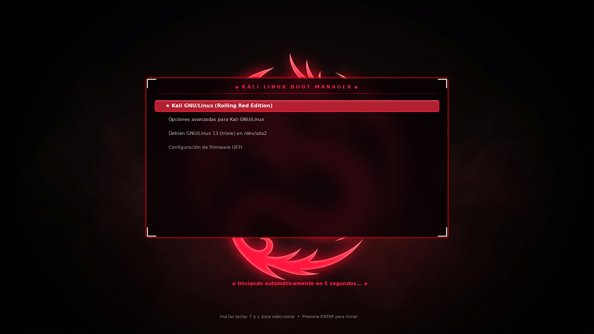

# 🐉 Kali Red Dragon Suite

<div align="center">



**Una suite visual completa, agresiva y cinematográfica para Kali Linux.**  
Transforma toda la experiencia visual de inicio a fin: desde el arranque de **GRUB** con efecto *frosted glass*, pasando por el logo de carga de **Plymouth**, la pantalla de **Login (LightDM)**, hasta el escritorio **XFCE** con bordes rojos neón de 2px y animaciones dinámicas del dragón al abrir y cerrar ventanas.

[](https://www.kali.org/)
[](https://www.xfce.org/)
[](https://www.python.org/)
[](LICENSE)

</div>

---

## ⚡ Características Principales

### 1. 🎛️ Menú de Arranque GRUB (Frosted Glass & Cyberpunk)
* **Tarjeta Central con Desenfoque Gaussiano (*Blur*):** Contenedor oscuro ahumado de cristal que permite leer las opciones con máxima nitidez sobre el fondo del dragón.
* **Borde Neón Carmesí de 2px:** Con corchetes cibernéticos en las 4 esquinas y cabecera iluminada `◈ KALI LINUX BOOT MANAGER ◈`.
* **Cápsula de Selección Luminosa:** Barra de selección activa con resplandor carmesí (`#ff1744`) y texto en blanco brillante.
* **Iconos de Sistema Integrados:** Soporte para iconos de Kali Linux, Debian, UEFI y Memtest.

### 2. ⚡ Pantalla de Carga de Arranque (Plymouth)
* **Logo del Dragón de Kali Carmesí:** Reemplaza el logo azul original por una versión en rojo neón que palpita suavemente durante la carga del sistema operativo.
* **Traspaso de Video Suave:** Fondos de transición de 1080p sin pantallas azules intermedias.

### 3. 🛡️ Pantalla de Inicio de Sesión (LightDM Greeter)
* **Avatar del Dragón de Kali:** Disco de cristal oscuro con el emblema del dragón y halo de energía circular.
* **Tarjeta Central Flotante (*Glassmorphism*):** Cuadro de login con marco de 2px rojo neón y sombra exterior difuminada.
* **Caja de Contraseña Reactiva:** Resplandor de enfoque en rojo neón al escribir tu contraseña.
* **Botón de Iniciar Sesión con Degradado:** Estilo moderno y botones con efectos de iluminación.

### 4. 🪟 Bordes de Ventana Continuos XFWM4 (2px Red Dark)
* **Bordes Perfectos de 2px:** Bordes en `#ec0101` activo y `#aa1919` inactivo en los cuatro costados de las ventanas.
* **Botones con Transparencia 100%:** Elimina cualquier corte o hueco en el borde superior de la barra de título.
* **Compatibilidad CSD (GTK-3 y GTK-4):** Bordes aplicados a aplicaciones cliente como Firefox, Mousepad, QTerminal, Thunar, etc.

### 5. 🐉 Animador Dinámico de Ventanas (0% CPU Idle)
* **Animación de Apertura:** El dragón vuela en una órbita espiral inclinada dejando una estela de plasma y fuego rojo, se clava en el centro y se expande en el marco de la ventana mientras la aplicación aparece en fundido suave.
* **Animación Inversa de Cierre:** El marco de la ventana implosiona hacia su centro en un vórtice, liberando al dragón que despega en espiral hacia el fondo.
* **Dimensionamiento Automático (`960x620`):** Todas las aplicaciones se abren de forma consistente y centradas.
* **Motor Basado en Eventos Nativos X11:** Uso de procesador en reposo: **0.0%**.

---

## 🚀 Instalación Rápida

Para instalar toda la suite automáticamente en tu sistema Kali Linux:

```bash
# 1. Clonar el repositorio (o ingresar a la carpeta)
cd Kali-Red-Dragon-Suite

# 2. Ejecutar el instalador maestro con permisos de administrador
sudo ./install.sh
```

El script se encarga de:
1. Crear respaldos automáticos de seguridad de tu configuración original (`.pristine_backup`).
2. Instalar todos los componentes en `/boot/`, `/etc/`, `/usr/share/` y tu carpeta de usuario.
3. Compilar GRUB y el archivo de arranque `initramfs`.
4. Iniciar automáticamente el demonio del animador.

---

## 🔄 Restauración / Desinstalación

Si en cualquier momento deseas restaurar la configuración original de fábrica de Kali Linux:

```bash
sudo ./uninstall.sh
```

---

## 📁 Estructura del Repositorio

```text
Kali-Red-Dragon-Suite/
├── README.md                          # Documentación completa
├── .gitignore                         # Archivos ignorados por Git
├── install.sh                         # Instalador maestro automatizado
├── uninstall.sh                       # Restaurador de fábrica
├── assets/                            # Fondos y previews
│   ├── kali_dragon_official.jpg
│   ├── preview_grub.png
│   └── dragon_sprite.png
├── boot/                              # Componentes de arranque
│   ├── grub/                          # Tema de GRUB (theme.txt, PNGs, iconos)
│   ├── plymouth/                      # Animación de carga de Linux (Plymouth)
│   └── transition/                    # Fondos de traspaso GRUB-Kernel
├── login/                             # Pantalla de Login (LightDM)
│   ├── lightdm-gtk-greeter.conf       # Configuración de greeter
│   ├── dragon-avatar.png              # Avatar del dragón
│   └── theme/Kali-Red-Dragon-Login/   # Tema GTK3 con estilos glassmorphism
└── desktop/                           # Entorno de Escritorio
    ├── xfwm4-theme/                   # Tema de bordes rojos para XFWM4
    ├── gtk-css/                       # Estilos CSS para aplicaciones CSD
    └── animator/                      # Demonio en PyQt6 del dragón volador
```

---

## 📄 Licencia

Distribuido bajo la Licencia MIT. Consulta `LICENSE` para más información.
