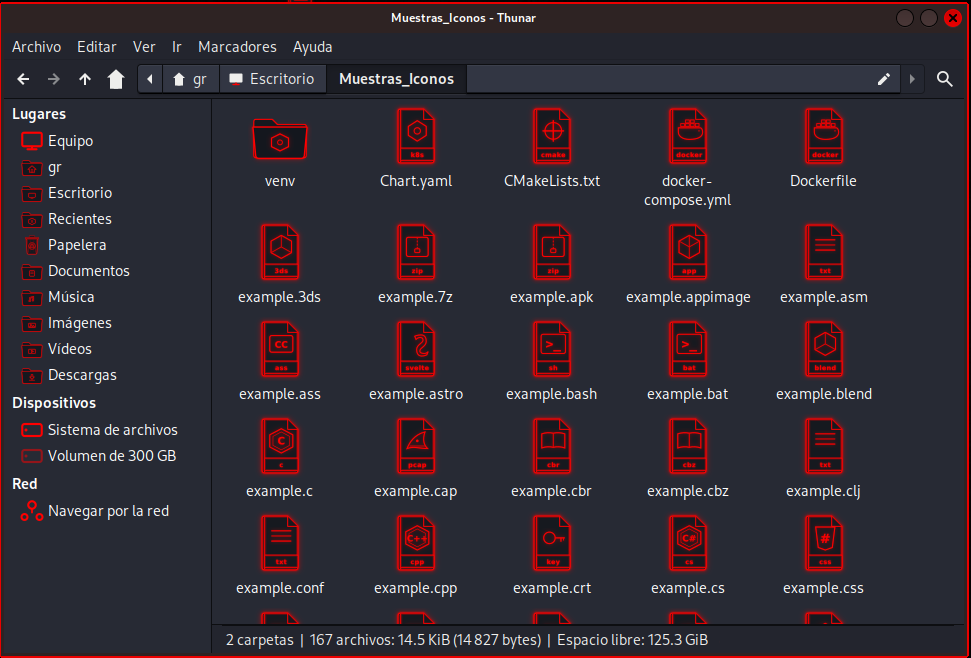

<div align="center">

# KALI DRAGON SUITE
### *Modular Cyberpunk & Neon Desktop Transformation for Kali Linux (XFCE)*

[](https://www.kali.org/)
[](https://www.xfce.org/)
[](#color-editions)
[](#technical-specifications)
[](LICENSE)

<br/>

> **A complete, lightweight, and fully modular suite designed to elevate the visual experience of Kali Linux:**  
> 1080p GRUB boot menu, Plymouth splash screen, LightDM login, glassmorphic lockscreen, 2px neon borders, cinematic dragon window animator (60 FPS), high-contrast GTK3/4 themes, complete neon wireframe icon suite with zero fallbacks, and custom ZSH terminal prompt.

</div>

---

## Table of Contents
1. [Creator Note](#note)
2. [Quick Start](#quick-start-1-step-installation)
3. [Project Overview](#what-does-this-project-do)
4. [Visual Gallery](#visual-gallery)
5. [Neon Wireframe Icon Suite: Architecture & Families](#neon-wireframe-icon-suite)
6. [Color Editions (15 Variants)](#color-editions)
7. [Installation Modules](#installation-modules)
8. [Installation Guides](#installation-guides)
9. [Restoration & Uninstallation](#restoration--uninstallation-zero-risk)
10. [Repository Structure](#project-structure)
11. [Technical Specifications](#technical-specifications)
12. [Support & Donations](#support--contributions)

---

## NOTE

> *"This is my first Linux project and I wanted to share it with the community. The idea was born to give Kali Linux an epic cyberpunk / neon aesthetic while keeping it ultra-lightweight and resource-efficient.*  
> *Several base textures and arts were generated with help from Gemini. If you find any visual bug, details, or have improvement ideas, please feel free to open an [Issue](https://github.com/Gabo-Razo/Kali-Dragon-Suite/issues) and I will address it as soon as possible. I hope you find it useful and enjoy it!"*  
> — **Gabo Razo** ([@Gabo-Razo](https://github.com/Gabo-Razo))

---

## Quick Start (1-Step Installation)

If you want to install and try the suite immediately on your machine:

```bash
git clone https://github.com/Gabo-Razo/Kali-Dragon-Suite.git
cd Kali-Dragon-Suite
sudo ./install.sh
```
*The installer opens a numbered interactive menu allowing you to pick your favorite color and select which modules to deploy.*

---

## What does this project do?

Kali Dragon Suite transforms system visual components safely and modularly:

* **Boot Menu (GRUB):** 1080p high-definition boot selection screen with cybernetic frames and 70+ custom distribution icons.
* **Boot Splash (Plymouth):** Pure black screen with a smooth glowing dragon animation prior to login.
* **Login Screen (LightDM):** Modern greeting interface with glassmorphic styling and circular illuminated user selector.
* **Lock Screen (Screensaver):** Fast session unlocking dialog with circular illuminated user avatar.
* **Window Borders (XFWM4 & GTK3/4):** 2px crisp neon borders with solid, legible dark baseplates (`#16191f` / `#23252e`) eliminating transparency bugs.
* **Dragon Animator (60 FPS):** A background daemon launching an orbital dragon with plasma particles around newly opened windows.
* **Neon Wireframe Icon Suite (Kali Dragon Icons):** 1000+ vector SVG icons with blueprint aesthetics, standalone cybernetic trashcan, and comprehensive tech family unification with zero generic fallbacks.
* **Terminal Prompt (ZSH):** Two-line high-contrast prompt with solid color-matched cursor without terminal lag.

---

## Visual Gallery

<div align="center">

### 1. Neon Wireframe Icon Suite (Cyberpunk Blueprints & Tech Families)
*Scalable vector icons with dual glowing contours, exterior neon glow, and exhaustive ecosystem unification.*



<br/>

### 2. Cinematic Dragon Window Animator (60 FPS Orbital Launch)
*The dragon traverses window borders with plasma particles and neon aura upon application launch.*


<br/>

### 3. GRUB Boot Menu (1080p Crystal Glass)
*Deep dark background with neon halo, cybernetic grid, and 70+ OS icons.*


<br/>

### 4. Plymouth Splash Screen (Neon Dragon)
*Fluid boot animation on pure black canvas.*


<br/>

### 5. Lockscreen & Screensaver (xfce4-screensaver)
*Glassmorphic prompt with circular illuminated user avatar and action controls.*


<br/>

### 6. Crisp 2px Window Borders & GTK Desktop Theme
*Solid, opaque dark backgrounds with crisp neon 2px borders.*


</div>

---

## Neon Wireframe Icon Suite

The **Kali-Dragon-Icons** suite was programmatically generated in Ruby 3.3, guaranteeing that every file, folder, and device is rendered as a clean cybernetic blueprint with an outer neon glow (`feGaussianBlur`), dual fine stroke lines, and a dedicated bottom label banner.

### 1. System Directories & Elements Modified

| Directory | Element Type | Description |
| :--- | :--- | :--- |
| `scalable/places/` | System Folders | Home, Desktop, Downloads, Documents, Music, Pictures, Videos, Templates, Public, Code Projects, Git Repositories, and Python Virtual Environments (`venv`). |
| `scalable/status/` | Trash Can | Standalone trashcan in Empty and Full states with cybernetic warning core. |
| `scalable/devices/` | Storage & Network | Hard drives, USB flash drives, removable media, local machines, and network servers. |
| `scalable/apps/` | Launchers & Binaries | Application shortcuts `.desktop`, Windows executables `.exe`, and Linux executable `.appimage` packages. |
| `scalable/mimetypes/` | Files & Documents | 1000+ MIME definitions spanning source code, scientific data, multimedia, and office formats. |
| `symbolic/` | Sidebars | 16x16 monochrome glyphs for Thunar sidebar and XFCE panels. |

---

### 2. Unified Technology Families

To prevent visual inconsistencies, related formats in an ecosystem share their core 3D wireframe emblem while displaying their distinct sub-type label in the banner:

| Technology Family | Formats and Extensions Included | Visual Emblem |
| :--- | :--- | :--- |
| **Ruby Family** | `.rb`, `.erb`, `.rake`, `Gemfile`, `Rakefile` | Faceted geometric diamond with precision cuts. |
| **Python Family** | `.py`, `.pyw`, `.pyx`, `.pyi`, `.ipynb` | Dual entwined cyber serpents / Quantum orbits. |
| **C & C++ Family** | `.c`, `.h`, `.cpp`, `.hpp`, `.hh`, `.hxx`, `.inl`, `.tpp` | Shielded hexagon with typographic core. |
| **C# & .NET Family** | `.cs`, `.vb`, `.fs` | Shielded hexagon with language identifier. |
| **JavaScript & TypeScript Family** | `.js`, `.jsx`, `.ts`, `.tsx`, `.mjs`, `.cjs` | High-density rectangular development badge. |
| **Web Styles Family** | `.css`, `.scss`, `.sass`, `.less`, `.styl` | Stylized CSS `#` shield. |
| **Systemd Services Family** | `.service`, `.timer`, `.socket`, `.target`, `.mount`, `.swap` | Orbital ring with process execution lightning bolt. |
| **Game Development Family** | `.gd`, `.tscn`, `.tres`, `.godot`, `.unity`, `.prefab` | Retro-futuristic gamepad with directional pad and action buttons. |
| **Database Family** | `.sql`, `.sqlite`, `.db`, `.s3db` | Three-tier hierarchical storage cylinder. |
| **DevOps & Infrastructure Family** | `Dockerfile`, `docker-compose.yml`, `Chart.yaml` / K8s, `.tf`, `.tfvars`, `Makefile`, `CMakeLists.txt`, `Jenkinsfile` | Shipping container, Kubernetes wheel, and CI badges. |
| **Cybersecurity & Forensics Family** | `.pcap`, `.pcapng`, `.cap` (Wireshark), `.key`, `.pem`, `.crt`, `.kdbx` (KeePass), `.yar` (YARA), `.ovpn` (VPN) | Wireshark packet capture fin, master key, and cryptographic lock. |
| **Hardware & EDA Family** | `.ino` (Arduino), `.hex`, `.bin`, `.vhd` (VHDL), `.v` / `.sv` (Verilog) | Polarity infinity loop and logic gates. |
| **Office Documents Family** | `.doc`, `.docx`, `.odt`, `.rtf`, `.pages` | Structured text page layout. |
| **Spreadsheets Family** | `.xls`, `.xlsx`, `.ods`, `.csv`, `.tsv` | Grid matrix of rows and columns. |
| **Presentations Family** | `.ppt`, `.pptx`, `.odp`, `.key` | Slide projector with circular sector graph. |
| **E-books & Comic Readers** | `.epub`, `.mobi`, `.djvu`, `.cbr`, `.cbz` | Isometric open book with illuminated spine. |
| **3D CAD & Modeling Family** | `.3ds`, `.blend`, `.obj`, `.stl`, `.gltf`, `.glb`, `.dxf`, `.step`, `.stp` | 3D wireframe isometric polyhedron. |
| **Terminal & Shell Family** | `.sh`, `.bash`, `.zsh`, `.ps1`, `.bat`, `.cmd` | Interactive console prompt screen `>_`. |
| **Subtitles Family** | `.srt`, `.vtt`, `.ass`, `.sub` | CC Synchronized closed captioning frame. |
| **Multimedia Family** | Vector (`.svg`), Image (`.png`, `.jpg`, `.webp`, `.gif`), Audio (`.mp3`, `.wav`, `.flac`), Video (`.mp4`, `.mkv`, `.avi`) | Vector node path, geometric landscape, sound wave equalizer, and media player. |
| **Other Supported Languages** | `.java`, `.kt`, `.swift`, `.dart`, `.rs`, `.go`, `.lua`, `.php`, `.vue`, `.svelte`, `.astro`, `.zig`, `.sol`, `.mat`, `.r`, `.jl`, `.nim`, `.asm`, `.tex` | Stylized wireframe emblems with official typography. |

---

## Color Editions

The suite includes 15 calibrated color editions providing vivid neon brilliance without visual fatigue:

| # | Edition | CLI Flag | Primary Color | Secondary Color | Vibe & Theme Atmosphere |
| :-: | :--- | :--- | :--- | :--- | :--- |
| 1 | **Crimson Red** | `red` | `#ff1744` | `#ec0101` | Crimson Neon Red (Original Kali Dragon Edition) |
| 2 | **Plasma Blue** | `blue` | `#00b0ff` | `#2979ff` | Cyberpunk Electric Blue / High Voltage |
| 3 | **Toxic Green** | `green` | `#00e676` | `#00c853` | Matrix Hacker Green / Classic Terminal |
| 4 | **Cyber Yellow** | `yellow` | `#ffd600` | `#ffc107` | High-Voltage Industrial Yellow |
| 5 | **Neon Purple** | `purple` | `#d500f9` | `#aa00ff` | Synthwave Purple / Night City |
| 6 | **Neon Orange** | `orange` | `#ff6d00` | `#ff5722` | Incandescent Lava & Fire Orange |
| 7 | **Electric Lime** | `lime` | `#76ff03` | `#64dd17` | Acid Lime Green / Cyber Radiation |
| 8 | **Cyber Pink** | `pink` | `#ff4081` | `#f50057` | Arcade Neon Pink / Neon City |
| 9 | **Neon Cyan** | `cyan` | `#18ffff` | `#00e5ff` | Arctic Ice Glacier Cyan |
| 10 | **Neon Teal** | `teal` | `#00f2fe` | `#00b4d8` | Cyber Aqua Teal |
| 11 | **Cyber Gold** | `gold` | `#ffab00` | `#ffd700` | Metallic Amber Night City Gold |
| 12 | **Royal Indigo** | `indigo` | `#536dfe` | `#3d5afe` | Deep Sapphire Indigo Blue |
| 13 | **Quantum Mint** | `mint` | `#64ffda` | `#00bfa5` | Quantum Mint Green / Plasma Crystal |
| 14 | **Blood Ruby** | `ruby` | `#e91e63` | `#c2185b` | Dark Wine Cyber Ruby |
| 15 | **Cyber Magenta** | `magenta` | `#ff007f` | `#e00070` | 80s Retrowave Magenta |

---

## Installation Modules

You can deploy the entire suite or specific modules using CLI flags:

| Module | CLI Flag | Components Covered |
| :--- | :--- | :--- |
| **Complete Suite** | `--all` | Installs all 8 components simultaneously. |
| **All Boot Components** | `--boot-only` | Sets up GRUB boot menu and Plymouth splash. |
| **GRUB Only** | `--grub-only` | Installs 1080p GRUB theme with 70+ OS icons. |
| **Plymouth Only** | `--plymouth-only` | Sets up the dragon boot splash animation. |
| **Login & Lockscreen Only** | `--login-only` | Configures LightDM, screensaver, and logout dialogs. |
| **Window Borders Only** | `--borders-only` | Deploys 2px neon borders without transparency bugs. |
| **Animator Only** | `--animator-only` | Launches the 60 FPS orbital window daemon. |
| **Wallpaper Only** | `--wallpaper-only` | Applies the 1080p Dragon wallpaper in the chosen edition. |
| **Icons Only** | `--icons-only` | Deploys the complete neon wireframe icon suite. |
| **Terminal Only** | `--terminal-only` | Configures two-line ZSH prompt and cursor colors. |
| **Desktop Only** | `--desktop-only` | Deploys borders, animator, wallpaper, icons, and terminal. |

---

## Installation Guides

### 1. Master Modular Installer (`install.sh`)
Allows selecting any color and combining components:

```bash
# Install complete suite in Crimson Red:
sudo ./install.sh --color red --all

# Install only the icon suite in Neon Purple:
sudo ./install.sh --color purple --icons-only

# Install desktop environment in Cyber Gold:
sudo ./install.sh --color gold --desktop-only

# Install bootloader in Plasma Blue:
sudo ./install.sh --color blue --boot-only
```

---

### 2. Standalone Icon Installer (`install_icons.sh`)
Designed to install or switch between the 15 icon variants instantly without requiring `sudo`:

```bash
# Direct color selection:
./install_icons.sh red
./install_icons.sh purple
./install_icons.sh cyan
./install_icons.sh gold

# Interactive numbered menu:
./install_icons.sh

# System-wide multi-user installation (in /usr/share/icons):
sudo ./install_icons.sh --system -c green
```

---

## Restoration & Uninstallation (Zero Risk)

The suite provides modular restoration scripts to revert changes back to factory defaults cleanly at any time:

### 1. Master Modular Uninstaller (`uninstall.sh`)
```bash
# Restore EVERYTHING back to factory original:
sudo ./uninstall.sh --all

# Restore only the original icon theme (Flat-Remix-Blue-Dark):
sudo ./uninstall.sh --icons-only

# Restore only the boot components (GRUB + Plymouth):
sudo ./uninstall.sh --boot-only

# Restore only the login screen (LightDM):
sudo ./uninstall.sh --login-only

# Restore only the desktop environment (Icons, GTK Borders, Wallpaper & Terminal):
sudo ./uninstall.sh --desktop-only

# Restore everything and delete installed custom theme directories:
sudo ./uninstall.sh --all --clean
```

---

### 2. Standalone Icon Uninstaller (`uninstall_icons.sh`)
To restore default icons without administrator privileges:

```bash
# Restore Kali default icon theme:
./uninstall_icons.sh

# Restore and remove installed custom icon directories:
./uninstall_icons.sh --clean

# Restore to a specific alternative theme installed on the system:
./uninstall_icons.sh -t "Papirus-Dark"
```

---

### 3. Graphical Interface (XFCE Settings)
1. Navigate to **Applications -> Settings -> Appearance** and select `Kali-Dark`.
2. Navigate to **Settings -> Window Manager** and select `Kali-Dark`.
3. Navigate to **Settings -> Icons** and select `Flat-Remix-Blue-Dark`.

---

## Project Structure

```text
Kali-Dragon-Suite/
├── install.sh                  # Master modular suite installer
├── install_icons.sh            # Standalone icon suite installer
├── uninstall.sh                # Master modular factory uninstaller
├── uninstall_icons.sh          # Standalone icon uninstaller
├── generate_dragon_icons.rb    # Ruby 3.3 vector icon compilation engine
├── custom-cyber-dragon.xml     # Shared MIME database package
├── assets/                     # Wallpapers, textures, sprites, and screenshots
│   └── previews/               # Documentation visual gallery previews
├── variants/                   # 15 color edition tree
│   ├── red/                    # Crimson Red assets (GRUB, Plymouth, GTK, Icons)
│   ├── blue/                   # Plasma Blue assets
│   └── ...                     # (15 complete variant directories)
├── README.md                   # Official documentation (Spanish)
├── README_EN.md                # Official documentation (English)
└── LICENSE                     # MIT Open Source License
```

---

## Technical Specifications

* **Ultra-Low Resource Footprint (0.0% CPU idle):** The animator runs as a native `systemd --user` daemon, activating only upon window creation via X11 events.
* **Solid & Opaque Dark Bases (`#16191f` / `#23252e`):** Transparencies removed to guarantee absolute legibility across file managers, IDEs, and terminals.
* **Pure SVG Scalability:** All icons render crisply on 1080p, 2K, 4K, and HiDPI displays.
* **Preserved 1:1 Aspect Ratio:** The dragon sprite preserves exact mathematical proportions without stretching.
* **Resilient to Reboots & Sleep:** All background units restore automatically upon suspend and system reboot.

---

## Support & Contributions

If you find a bug or have ideas for new icons or color variants:
* Open an **[Issue](https://github.com/Gabo-Razo/Kali-Dragon-Suite/issues)** or submit a Pull Request.
* If you found this project helpful, please consider leaving a **Star** on GitHub.

---

## Sponsorship & Donations

If you enjoy this project and wish to support ongoing development:

<div align="center">

[](https://github.com/sponsors/Gabo-Razo)

*Any sponsorship or support is greatly appreciated.*

</div>

---

<div align="center">

Developed with dedication by **[Gabo Razo](https://github.com/Gabo-Razo)** for the **Kali Linux & Open Source** community.

</div>
