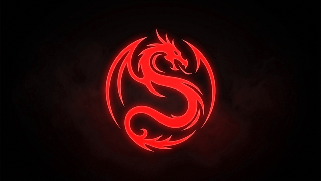

# 🐉 Kali Dragon Theme Suite (15 Color Editions)

<div align="center">

[](README.md)
[](README_EN.md)



**A complete, 100% modular, and cinematic visual theme suite for Kali Linux.**  
Transforms the entire visual experience across **15 high-fidelity color editions**: from the **GRUB** bootloader with a *frosted glass* menu card and 70+ OS icons, the **Plymouth** boot animation, the **Login & Lockscreen Triad** (LightDM, suspend/wake-up lock dialog, and session logout prompt), to the **XFCE** desktop with 2px solid window borders, panel icons, and flying dragon window animations.

[](https://www.kali.org/)
[](https://www.xfce.org/)
[](#-15-available-color-editions)
[](#-granular-modular-installation-by-component)
[](https://www.python.org/)
[](LICENSE)

</div>

---

## 🎨 15 Available Color Editions

| # | Color | Edition Name | Primary Tone | Preview |
| :-: | :---: | :--- | :---: | :---: |
| **1** | 🔴 | **Crimson Red** *(Original / Favorite)* | `#ff1744` / `#ec0101` | [View](assets/preview_red.png) |
| **2** | 🔵 | **Plasma Blue** *(Cyberpunk Blue)* | `#00b0ff` / `#2979ff` | [View](assets/preview_blue.png) |
| **3** | 🟢 | **Toxic Green** *(Hacker Green / Matrix)* | `#00e676` / `#00c853` | [View](assets/preview_green.png) |
| **4** | 🟡 | **Cyber Yellow** *(Neon Gold)* | `#ffd600` / `#ffc107` | [View](assets/preview_yellow.png) |
| **5** | 🟣 | **Neon Purple** *(Synthwave / Vaporwave)* | `#d500f9` / `#aa00ff` | [View](assets/preview_purple.png) |
| **6** | 🟠 | **Neon Orange** *(Incandescent / Lava)* | `#ff6d00` / `#ff5722` | [View](assets/preview_orange.png) |
| **7** | 🍈 | **Electric Lime** *(Acid Lime)* | `#76ff03` / `#64dd17` | [View](assets/preview_lime.png) |
| **8** | 🌸 | **Cyber Pink** *(Arcade Pink / Magenta)* | `#ff4081` / `#f50057` | [View](assets/preview_pink.png) |
| **9** | 💎 | **Neon Cyan** *(Arctic Ice)* | `#18ffff` / `#00e5ff` | [View](assets/preview_cyan.png) |
| **10** | 🖤 | **Stealth White** *(Pure White / Ghost)* | `#ffffff` / `#f5f5f5` | [View](assets/preview_white.png) |
| **11** | 🪙 | **Cyber Gold** *(Metallic Gold / Night City)*| `#ffab00` / `#ffd700` | [View](assets/preview_gold.png) |
| **12** | 🌊 | **Royal Indigo** *(Deep Sapphire)* | `#536dfe` / `#3d5afe` | [View](assets/preview_indigo.png) |
| **13** | 🧪 | **Quantum Mint** *(Quantum Mint)* | `#64ffda` / `#00bfa5` | [View](assets/preview_mint.png) |
| **14** | 🩸 | **Blood Ruby** *(Dark Wine)* | `#e91e63` / `#c2185b` | [View](assets/preview_ruby.png) |
| **15** | 🥈 | **Chrome Silver** *(Metallic Silver / Chrome)*| `#eceff1` / `#cfd8dc` | [View](assets/preview_silver.png) |

---

## 🚀 Quick Start & Installation

```bash
# 1. Clone the repository
git clone https://github.com/Gabo-Razo/Kali-Dragon-Suite.git
cd Kali-Dragon-Suite

# 2. Run the interactive installer (choose from all 15 colors)
sudo ./install.sh
```

---

## 🧩 Granular Modular Installation (By Component)

You can install **only the specific components you want** without touching the rest of your system:

| Component | Example Command | Description |
| :--- | :--- | :--- |
| **🌟 Full System** | `sudo ./install.sh --color cyan --all` | Installs GRUB, Plymouth, Login/Lockscreen Triad, Borders, Dragon Animator, Icons & Terminal. |
| **🎛️ Full Bootloader** | `sudo ./install.sh --color gold --boot-only` | Installs GRUB Frosted Glass + Plymouth boot animation. |
| **🔘 GRUB Menu Only** | `sudo ./install.sh --color white --grub-only` | Installs only the GRUB boot menu with 70+ OS icons and glowing selectors. |
| **⚡ Plymouth Splash Only**| `sudo ./install.sh --color indigo --plymouth-only`| Installs only the pulsating dragon Plymouth boot animation. |
| **🛡️ Login & Lock Triad** | `sudo ./install.sh --color mint --login-only` | **1)** LightDM greeter with dragon avatar & 1080p backdrop.<br>**2)** Suspend/Wake-up lock dialog with matching avatar, text colors & 1080p backdrop.<br>**3)** Session logout dialog with interactive glass buttons. |
| **🐉 Dragon Animator Only**| `sudo ./install.sh --color ruby --animator-only` | Activates the flying dragon window spawn & close daemon (60 FPS / 0% CPU). |
| **🪟 Window Borders Only** | `sudo ./install.sh --color silver --borders-only`| Applies continuous 2px solid borders to all windows (XFWM4 & GTK). |
| **🖼️ Wallpaper Only** | `sudo ./install.sh --color cyan --wallpaper-only`| Applies the 1080p dragon wallpaper to the desktop. |
| **🎨 Panel & Icons Only** | `sudo ./install.sh --color gold --icons-only` | Changes the Kali application menu icon, panel action buttons, and system icons. |
| **💻 Terminal Only** | `sudo ./install.sh --color white --terminal-only` | Updates ZSH/Bash prompt colors and cursor to the selected color. |
| **🖥️ Desktop Only** | `sudo ./install.sh --color indigo --desktop-only` | Installs Borders + Animator + Wallpaper + Icons + Terminal (without touching GRUB). |

---

## ⚡ Command-Line Quick Flags

```bash
sudo ./install.sh --color red --all       # 🔴 Crimson Red
sudo ./install.sh --color blue --all      # 🔵 Plasma Blue
sudo ./install.sh --color green --all     # 🟢 Toxic Green
sudo ./install.sh --color yellow --all    # 🟡 Cyber Yellow
sudo ./install.sh --color purple --all    # 🟣 Neon Purple
sudo ./install.sh --color orange --all    # 🟠 Neon Orange
sudo ./install.sh --color lime --all      # 🍈 Electric Lime
sudo ./install.sh --color pink --all      # 🌸 Cyber Pink
sudo ./install.sh --color cyan --all      # 💎 Neon Cyan / Ice
sudo ./install.sh --color white --all     # 🖤 Stealth White
sudo ./install.sh --color gold --all      # 🪙 Cyber Gold
sudo ./install.sh --color indigo --all    # 🌊 Royal Indigo
sudo ./install.sh --color mint --all      # 🧪 Quantum Mint
sudo ./install.sh --color ruby --all      # 🩸 Blood Ruby
sudo ./install.sh --color silver --all    # 🥈 Chrome Silver
```

---

## 🌐 Universal OS & Distro Support

Includes **70+ custom vector circular logos** in all 15 colors for automatic icon matching:
* **Linux:** Kali, Arch, Garuda, Debian, Ubuntu, Linux Mint, Pop!_OS, Fedora, openSUSE, Gentoo, NixOS, Alpine, Zorin, Void, Parrot, BlackArch, Tails, CentOS, Rocky, etc.
* **Other OS:** Windows 11/10/7, macOS / Apple, FreeBSD, OpenBSD, Android-x86.
* **Utilities:** UEFI Firmware / BIOS, Memtest86+, Recovery Mode, Reboot, Shutdown.

---

## 🔄 Factory Reset / Uninstall

To restore all default factory settings anytime:
```bash
sudo ./uninstall.sh
```

---

## 📄 License

Distributed under the MIT License. See `LICENSE` for more information.
